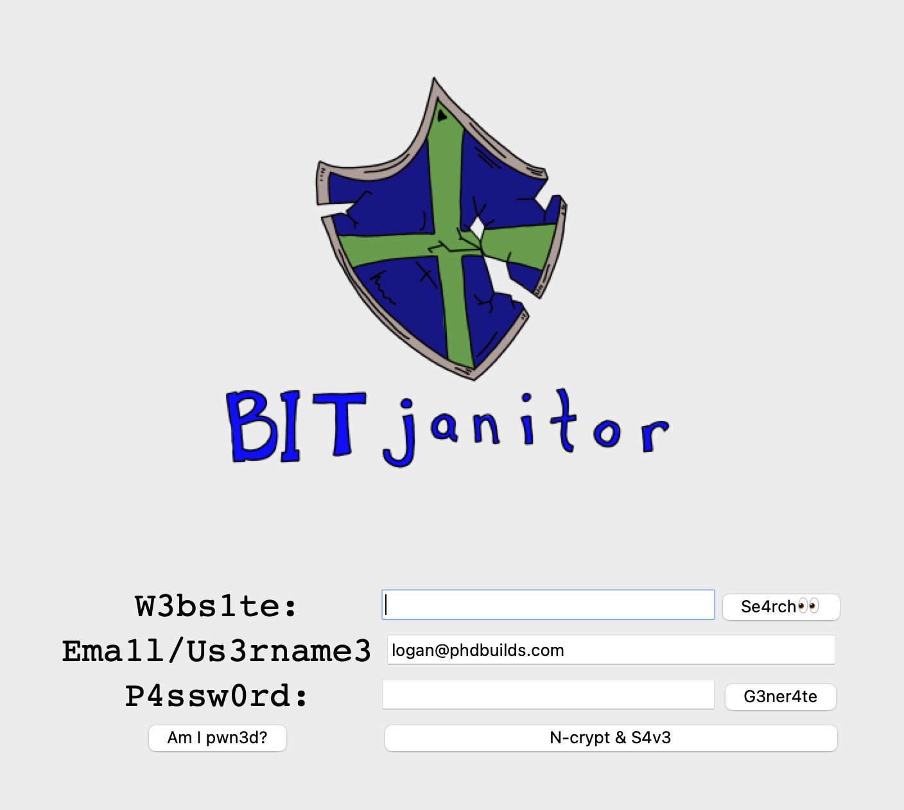
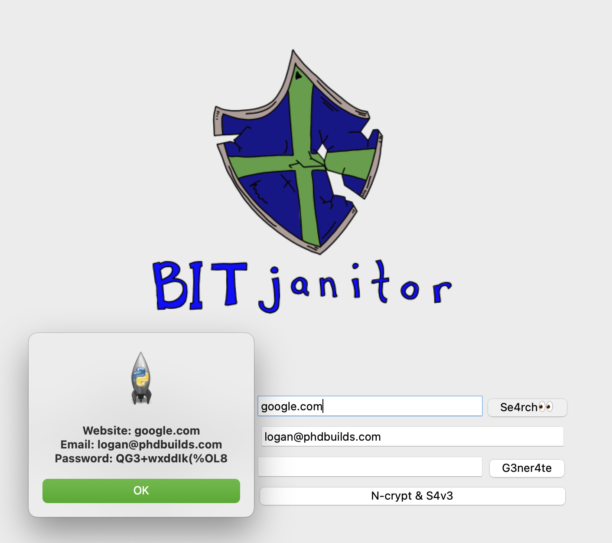
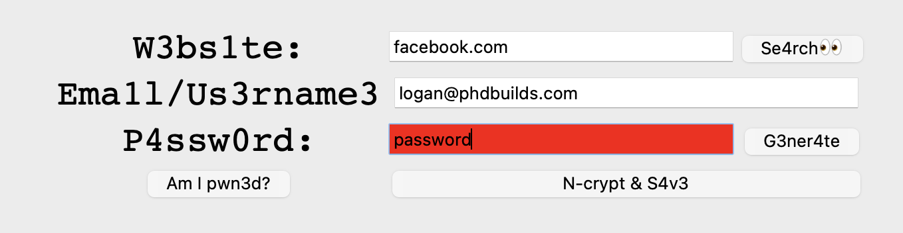
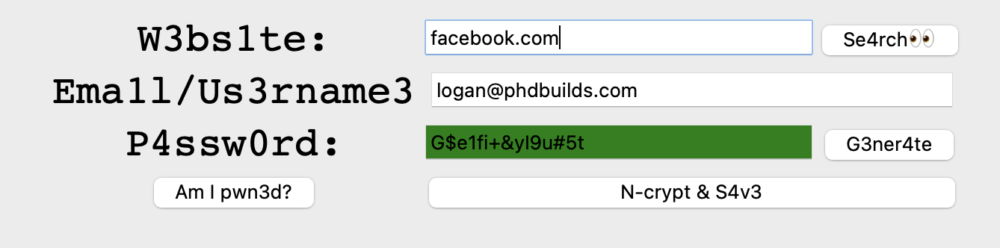

# Bit Janitor
This was a spin off day 29 of Angela Yu's Hundred Days of Python course. I really enjoyed this one so took it a bit further than the requirements.

This has been tested and working on both macOS and Debian flavors of Linux.

# Usage
1. Clone the repo 

2. Create python virtual environment (optional)
 - If you do, make sure to run `.venv/bin/activate` (or whatever you named it) to activate your virtual Python environment.

3. Install requirements.txt
 - `pip install -r requirements.txt`

4. Run `python3 main.py`

5. Now you are met with the UI:

6. If you already have something saved, you can see the password. It will also copy that password to your clipboard

7. To create a new login save, enter the website name, your email, and either create or generate your password. To see if the password is in the pwned list, click the `Am I pwn3d?` button at the bottom. If it's a compromised password, the box will highlight red:

8. If the password is not compromised, it will light up gree:

Note this is a password list from danielmiessler's SecLists/Passwords/Leaked-Databases/hak5.txt

# Known issues 
If you get an error on "import _tkinter # If this fails your Python may not be configured for Tk", you can fix it with the following: (on macOS)

`brew install tcl-tk`
`brew install python-tk@3.13`

Confirm with `python3 -m tkinter`. You should get a window pop up in the top left.

After this finishes, it should run without issues
